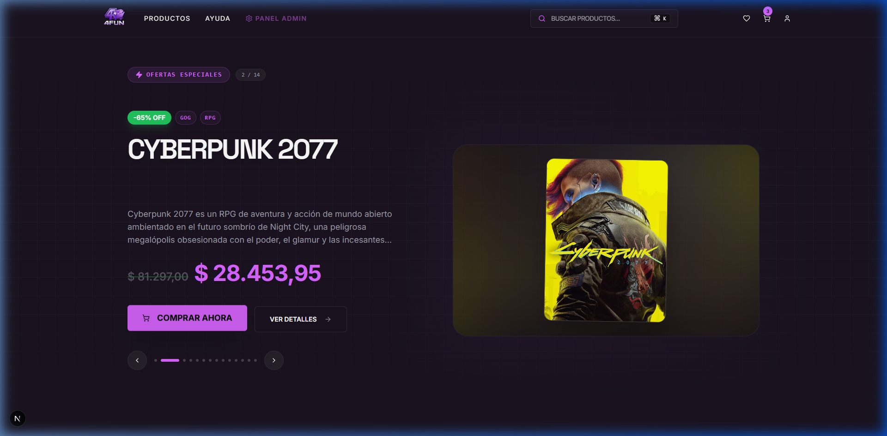
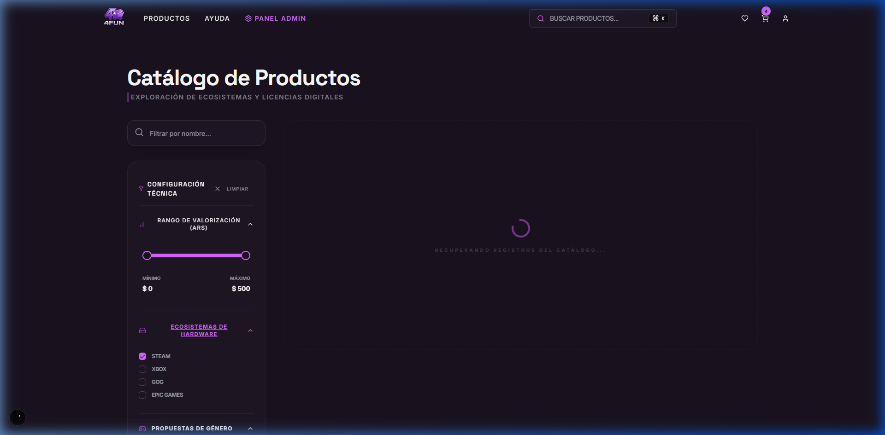
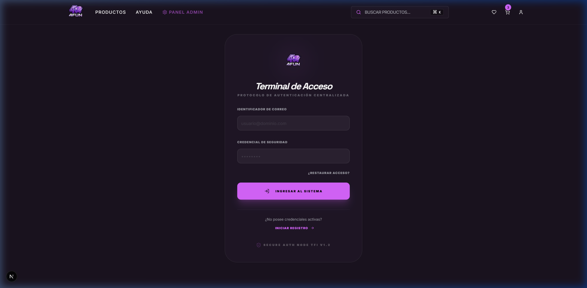
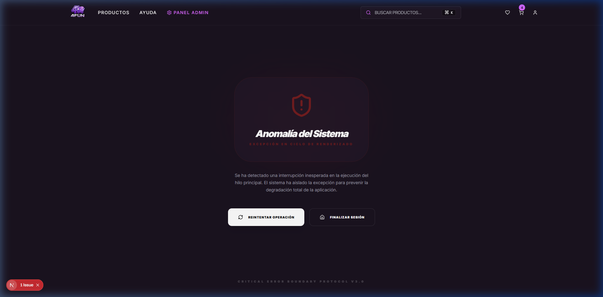
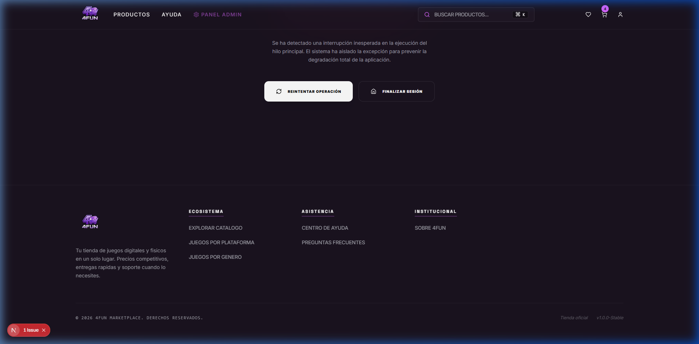
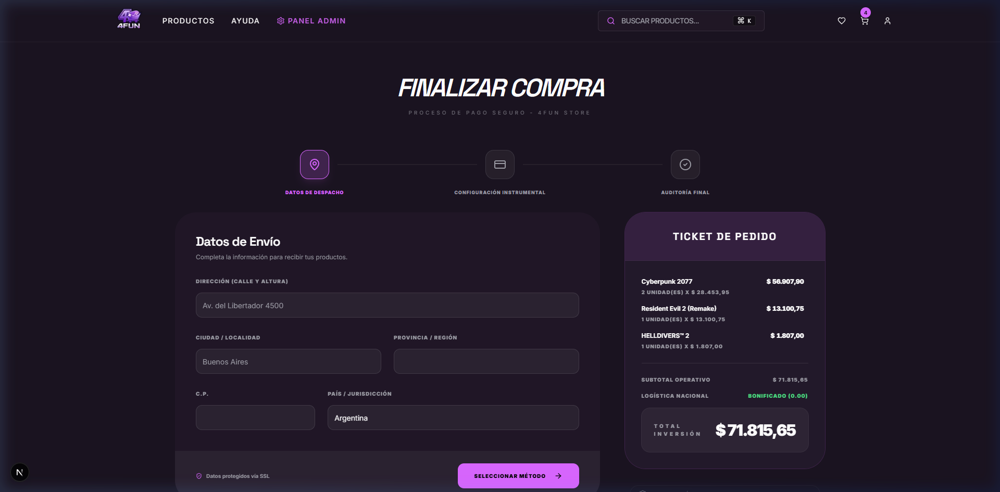
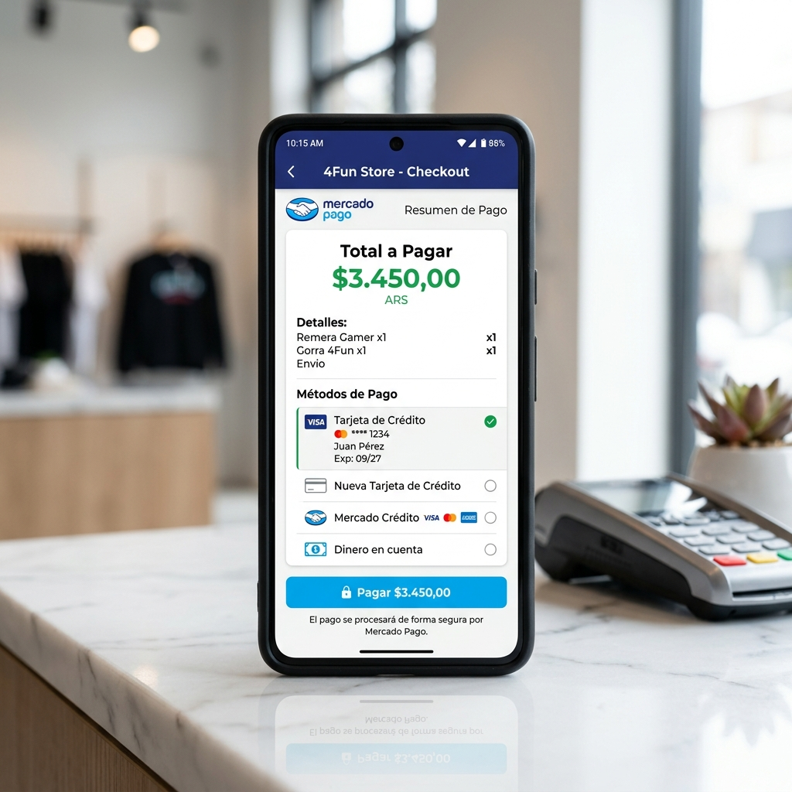

# Manual de Usuario Extendido: Sistema 4Fun Store (TFI)

Este documento describe el funcionamiento integral del sistema **4Fun Store**, detallando los flujos de interacción del cliente y las herramientas de auditoría administrativa con capturas de pantalla del entorno real.

---

## 1. Módulo Público (Experiencia del Cliente)

El área pública permite a los usuarios navegar por el catálogo, gestionar su cuenta y realizar compras de forma segura.

### 1.1. Página Principal (Home)
La página de inicio presenta los productos más destacados y juegos con descuento. Incluye navegación rápida por plataforma y género.

### 1.2. Notificaciones de Estado (Toasts)
El sistema utiliza notificaciones reactivas (Toasts) para informar al usuario sobre el éxito de sus acciones, como añadir productos al carrito.

### 1.3. Navegación y Filtrado Avanzado
El motor de búsqueda permite filtrar el catálogo por categorías (PC, PS5, Xbox, etc.) para una localización precisa de títulos.

### 1.4. Detalle Técnico de Producto
Cada juego muestra su ficha técnica, descripción y los requisitos del sistema, vinculados mediante integridad referencial en la base de datos.

### 1.5. Autenticación y Seguridad
El ingreso está protegido por cifrado de extremo a extremo. Los usuarios pueden gestionar su perfil y recuperar su acceso mediante email.

---

## 2. Módulo de Administración (Auditoría y Gestión)

Acceso exclusivo para roles de administrador, orientado a la gestión de inventario y monitoreo comercial.

### 2.1. Dashboard de Métricas
Visualización en tiempo real de los indicadores clave de rendimiento (KPIs), como ventas totales y usuarios registrados.

### 2.2. Paso a Paso: Alta de Productos (Cloudinary Integration)
El sistema automatiza el almacenamiento de imágenes mediante la integración con Cloudinary.

**Paso 1: Formulario de Definición**
Se completan los metadatos del producto (Nombre, Descripción, Precio, Stock).

**Paso 2: Carga de Multimedia**
Al seleccionar una imagen, el sistema procesa el archivo y genera la URL persistente en la nube de forma asíncrona.

### 2.3. Gestión Maestra de Inventario
Vista tabular para la administración de stock, edición de precios y aplicación de la **Baja Lógica** (Baja de productos sin pérdida de integridad histórica).

---

## 3. Guía de Compra (Happy Path)

### 3.1. Revisión de Pedido (Carrito)
El usuario valida las unidades y el total final (calculado en pesos argentinos) antes de proceder a la facturación electrónica.

### 3.2. Pasarela de Pagos (Mercado Pago)
La plataforma redirige al entorno seguro de Mercado Pago para procesar la transacción bajo estándares de seguridad internacional.

---

> [!IMPORTANT]
> **Nota de Implementación:** Este manual refleja la versión 1.5 del sistema, optimizada para la defensa final del TFI. Todos los flujos han sido validados contra el motor de base de datos PostgreSQL.
